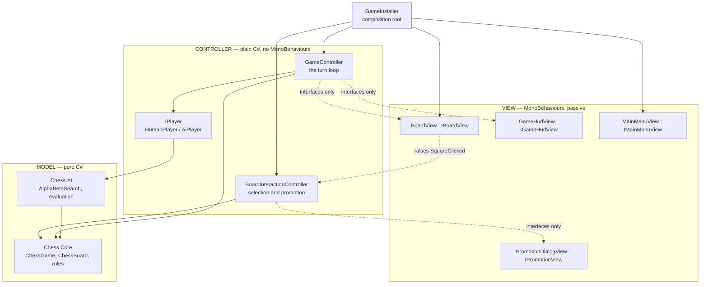

# Chess

A 2D chess game for Unity 6 with full FIDE rules and a minimax/alpha-beta computer opponent.
Two-player and vs-computer modes share a single code path.

The engine is complete and verified; the scene and the artwork are not yet built. Everything in
[Scene setup](#scene-setup) and [Art and audio to supply](#art-and-audio-to-supply) is what remains.

---

## Architecture

The whole design rests on one decision: **the chess engine has no `UnityEngine` reference at all.**
That is enforced by assembly definition files rather than by convention, and it buys three things.
The rules become unit-testable without a scene, the search can run on a background thread without
touching anything Unity owns, and the dependency arrow only ever points one way.

```
Assets/Scripts/
├── Chess.Core/     MODEL       pure C#, noEngineReferences: true
├── Chess.AI/       MODEL       pure C#, noEngineReferences: true, references Chess.Core
├── Chess.Unity/    VIEW +      references Chess.Core, Chess.AI, Input System, TextMeshPro, uGUI
│                   CONTROLLER
└── Chess.Tests/    EditMode    references Chess.Core, Chess.AI
```

If you ever add `using UnityEngine;` to a file under `Chess.Core` or `Chess.AI`, compilation fails.
That is the point.



### Model — `Chess.Core`

| Folder | Contents |
| --- | --- |
| `Primitives/` | `Square`, `Piece`, `PieceType`, `PieceColor`, `Move`, `MoveFlags`, `CastlingRights`, `MoveList` |
| `Board/` | `IBoard`, `IMutableBoard`, `ChessBoard`, `Zobrist`, `BoardStateUndo` |
| `Rules/` | `MoveGenerator` plus one `IPieceMoveGenerator` per piece, `AttackService`, `LegalityFilter` |
| `Rules/Draws/` | `IDrawRule` with fifty-move, threefold repetition and insufficient material |
| `Game/` | `IChessGame`, `ChessGame`, `GameStatusEvaluator`, `GameStatus`, `MoveRecord` |
| `Notation/` | `FenSerializer`, `SanFormatter` |

`ChessBoard` is a **mailbox 8x8** — a flat `Piece[64]`. Bitboards search faster, but a mailbox
reads like the thing it models, and at four to six ply that trade is worth making. Two structures
keep it fast anyway: per-colour piece lists, so move generation walks the sixteen occupied squares
instead of scanning all sixty-four, and an undo stack, so rewinding a move costs the same as making
one. **The search must undo rather than clone** — that is the single largest performance decision in
the codebase.

Legality is decided by make/test/unmake rather than by pin detection. A pin-aware generator would be
faster, but it is also where most engines' subtlest bugs live, particularly around en passant
discovered checks. Make/test/unmake is correct by construction for every case.

### Model — `Chess.AI`

Negamax with fail-soft alpha-beta:

```csharp
int Negamax(SearchContext context, int depth, int ply, int alpha, int beta) {
    if (depth <= 0) return _quiescenceSearch.Search(context, ply, alpha, beta);

    int best = -Infinity;
    foreach (Move move in orderedMoves) {
        board.MakeMove(move);
        int score = -Negamax(context, depth - 1, ply + 1, -beta, -alpha);
        board.UnmakeMove();

        if (score > best) best = score;
        if (best > alpha) alpha = best;
        if (best >= beta) { _moveOrderer.OnBetaCutoff(board, move, ply, depth); break; }
    }
    return best;
}
```

Negamax rather than separate minimising and maximising routines: chess is zero-sum, so the value of
a position to one player is the negation of its value to the other, and one routine that negates its
recursive result does the work of two.

| Component | Why it is there |
| --- | --- |
| `AlphaBetaSearch` | Negamax plus **iterative deepening**. Re-searching from depth one looks wasteful, but the shallow passes cost almost nothing and each leaves transposition entries that order the next pass. It also guarantees a usable move the moment the clock runs out. |
| `QuiescenceSearch` | Keeps searching captures and promotions past the horizon. Without it the engine scores "queen takes pawn" as a pawn up and never sees the recapture. **Not optional.** |
| `TranspositionTable` | Zobrist-keyed; stores depth, score, bound type and best move. Saves re-search and supplies the hash move that drives ordering. |
| `CompositeMoveOrderer` | Hash move, then MVV-LVA, then killers, then history. Ordering is the biggest lever on alpha-beta: good ordering visits roughly the square root of the nodes bad ordering does. |
| `TaperedEvaluator` | Material and Michniewski piece-square tables, scored with both midgame and endgame weights and blended by remaining material. Removes the discontinuity where the engine's idea of a good king square flips at an arbitrary threshold. |

Difficulty varies search depth *and* evaluation depth together, never by playing deliberate
blunders, which reads as erratic rather than weak:

| Difficulty | Max depth | Time budget | Evaluation |
| --- | --- | --- | --- |
| Easy | 2 | 0.5 s | Material only |
| Medium | 4 | 2 s | Material and piece-square tables |
| Hard | 6 | 5 s | Full tapered |

Both are tunable at runtime through an `AiDifficultyConfig` asset without recompiling.

### Controller — `Chess.Unity/Controllers` and `Players`

`GameController` and `BoardInteractionController` are **plain C# classes, not MonoBehaviours**, so
they can be constructed with test doubles. `GameInstaller` is the only MonoBehaviour that builds
anything, and it is the only place in the codebase that calls `new` on a collaborator. There are no
singletons and no service locator.

The turn loop contains **no branch on game mode and no branch on human versus AI**:

```csharp
while (!_game.IsGameOver && !cancellationToken.IsCancellationRequested) {
    IPlayer player = _players[(int)_game.SideToMove];
    Move move = await player.RequestMoveAsync(_game, cancellationToken);
    if (_game.TryMakeMove(move)) await ApplyMoveToViewsAsync(...);
}
```

`HumanPlayer` completes its task from a `TaskCompletionSource` when a click arrives; `AiPlayer`
completes its task from a background search. Both satisfy `IPlayer`, which is what makes
human-vs-human, human-vs-AI and AI-vs-AI the same code. `PlayerFactory` is the only place that reads
`GameMode`.

### View — `Chess.Unity/Views`

Every view is passive: it renders what it is told and raises raw input events. No view queries the
model, and no MonoBehaviour contains a rule.

`BoardView` builds the 8x8 grid at runtime, pools `PieceView`s, animates moves by coroutine and
flips orientation when the human plays black. `BoardGeometry` is the single place that answers
"where is e4", shared by the renderer and the input source. `PointerBoardInputSource` converts
screen points to squares through the new Input System's unified `Pointer` device, so one component
covers mouse and touch.

Every serialised UI reference is optional — a missing label is simply not written to — so the game
is playable against a bare canvas and the interface can be assembled piece by piece.

---

## Verification

```
Window ▸ General ▸ Test Runner ▸ EditMode ▸ Run All
```

83 tests, about three seconds.

The important ones are the **perft tests**, which count leaf nodes from six standard positions
against published values. A single missing or spurious move at any depth changes the total, so
matching them is strong evidence that generation, make and unmake are all exactly right. All six
positions pass at every depth:

| Position | Depth | Nodes |
| --- | --- | --- |
| Start | 5 | 4,865,609 |
| Kiwipete (castling, pins) | 4 | 4,085,603 |
| Position 3 (en passant) | 5 | 674,624 |
| Position 4 (promotions) | 4 | 422,333 |
| Position 5 | 4 | 2,103,487 |
| Position 6 | 4 | 3,894,594 |

The deepest cases are marked `[Explicit]` so the default run stays fast; run them from the Test
Runner when changing move generation. Alongside perft there are targeted tests for each special
rule, each draw condition, SAN disambiguation, and search behaviour including mate-in-one,
mate-in-two, quiescence declining a defended pawn, and cancellation still yielding a legal move.

---

## Scene setup

Nothing below requires writing code. Roughly twenty minutes.

### 1. Create the configuration assets

Right-click in the Project window:

- **Create ▸ Chess ▸ Board Theme** → `Assets/Settings/BoardTheme.asset`
- **Create ▸ Chess ▸ Piece Sprite Set** → `Assets/Settings/PieceSpriteSet.asset`
- **Create ▸ Chess ▸ AI Difficulty Config** → `Assets/Settings/AiDifficultyConfig.asset` (optional;
  the built-in curve is used when absent)

The board theme ships with sensible default colours. Assign the square and highlight sprites once
you have them; until then the board renders as flat tinted quads, which is enough to play.

### 2. Camera

One orthographic camera, positioned at `(0, 0, -10)` looking down `+Z`. `GameInstaller` frames it to
the board on start, so its size does not matter.

### 3. Board object

```
Board                     ← BoardView, PointerBoardInputSource
├── Squares               ← created automatically
├── Pieces                ← created automatically
└── Highlights            ← created automatically (HighlightLayer)
```

Add an empty GameObject named `Board` at the origin, then add `BoardView` and
`PointerBoardInputSource`. On `BoardView`, assign the board theme and piece sprite set, and drag the
`PointerBoardInputSource` component into the **Input Source Behaviour** field. The three child
objects are created at runtime if you leave them empty.

### 4. UI canvas

One Screen Space – Overlay canvas. Inside it:

| Object | Component | Notes |
| --- | --- | --- |
| `MainMenu` | `MainMenuView` | Three mode buttons, a difficulty dropdown, two side toggles, start and quit buttons |
| `Hud` | `GameHudView` | Turn label, status label, thinking indicator, restart / undo / menu buttons, game-over panel |
| `Hud/MoveList` | `MoveListView` | A `ScrollRect` whose content has a `VerticalLayoutGroup`; assign the content as **Row Container** |
| `Hud/WhiteCaptures` | `CapturedPiecesView` | A `HorizontalLayoutGroup` as **Icon Container** |
| `Hud/BlackCaptures` | `CapturedPiecesView` | As above |
| `PromotionDialog` | `PromotionDialogView` | Four buttons in the order **queen, rook, bishop, knight**, their `Image`s in the matching **Piece Icons** slots, and an optional cancel button |

Wire the buttons into the matching serialised fields. `GameHudView` and `MainMenuView` bind their
own click handlers in `Awake`, so do not add `onClick` entries by hand.

The move list and captured-piece rows build plain fallback rows when no prefab is assigned, so both
are legible before any UI art exists.

### 5. Audio

An empty GameObject named `Audio` with `ChessAudioService` and an `AudioSource`. Assign clips as you
get them; unassigned clips are silent.

### 6. Wire the installer

An empty GameObject named `Game` with `GameInstaller`. Assign:

- **Board Theme**, **Piece Sprites**, and optionally **Ai Difficulty Config**
- **Board Camera**, **Board View**, **Input Source**
- **Hud View**, **Promotion View**, **Main Menu View**, **Audio Service**

`GameInstaller` logs a clear error naming any field left empty, and a warning for each missing piece
sprite. Tick **Start Immediately** while iterating on the board to skip the menu.

### 7. Build settings

Add the scene under **File ▸ Build Profiles ▸ Scene List**.

---

## Art and audio to supply

Everything is optional in the sense that the game runs without it. Nothing here needs a code change.

### Piece sprites — 12 files

White and black × pawn, knight, bishop, rook, queen, king.

- PNG with transparency, 256 × 256
- Import as **Sprite (2D and UI)**, Pixels Per Unit **256**, so one sprite fills one square
- Filter Mode **Bilinear**, Compression **High Quality**

`PieceView` rescales to the square regardless of import settings, so an artist changing
pixels-per-unit cannot silently break alignment — but matching the numbers above keeps the sprites
crisp.

### Board and highlight sprites — 4 files

| Sprite | Purpose |
| --- | --- |
| Plain white square, 64 × 64 | Every board square, tinted per square. Light and dark colours come from `BoardTheme`, so **no separate light/dark art is needed** |
| Filled circle, 64 × 64 | Legal-move marker on empty squares |
| Hollow ring, 64 × 64 | Capture target, drawn around a capturable piece |
| Square outline or filled square, 64 × 64 | Selection, last move and check |

All four are tinted at runtime, so author them white.

### UI

- A **TextMeshPro font asset** (Window ▸ TextMeshPro ▸ Font Asset Creator)
- Panel and button sprites, whatever style you want

### Audio clips — 7 files

`move`, `capture`, `castle`, `check`, `promotion`, `game end`, `illegal move`. Short, under a second,
WAV or OGG. `ChessAudioService` picks the clip by what the move actually was, ordered by how much the
player needs to notice it: check outranks the capture that delivered it, which outranks the move.

### Prefabs to build (optional)

- **MoveListEntry** — a row with three `TMP_Text` children for move number, white move, black move
- **PromotionButton** — a `Button` with a child `Image`

Both have runtime fallbacks, so the game is fully playable before either exists.

---

## Packages

Everything needed is already in `Packages/manifest.json`: Input System 1.20, uGUI 2.5 (which bundles
TextMeshPro), Test Framework 1.7. **No additions required.**

---

## Extending it

The seams are deliberate:

| To do this | Write this | Nothing else changes |
| --- | --- | --- |
| Add a piece type | An `IPieceMoveGenerator`, registered in `MoveGenerator.CreateStandard` | Existing generators are untouched |
| Add a drawing condition | An `IDrawRule`, added to the list in `GameStatusEvaluator.CreateStandard` | The status evaluator is untouched |
| Add an evaluation term | An `IPositionEvaluator`, composed via `CompositeEvaluator` | The search is untouched |
| Improve move ordering | An `IMoveScoreHeuristic`, added to `CompositeMoveOrderer` | Score bands are documented in `OrderingScores` |
| Replace the AI entirely | An `IChessEngine` | `GameController` never knew minimax existed |
| Add drag-and-drop, touch or keyboard input | An `IBoardInputSource` | `BoardView` knows nothing about devices |
| Play over a network | An `IPlayer` | The turn loop is already asynchronous and cancellable |
